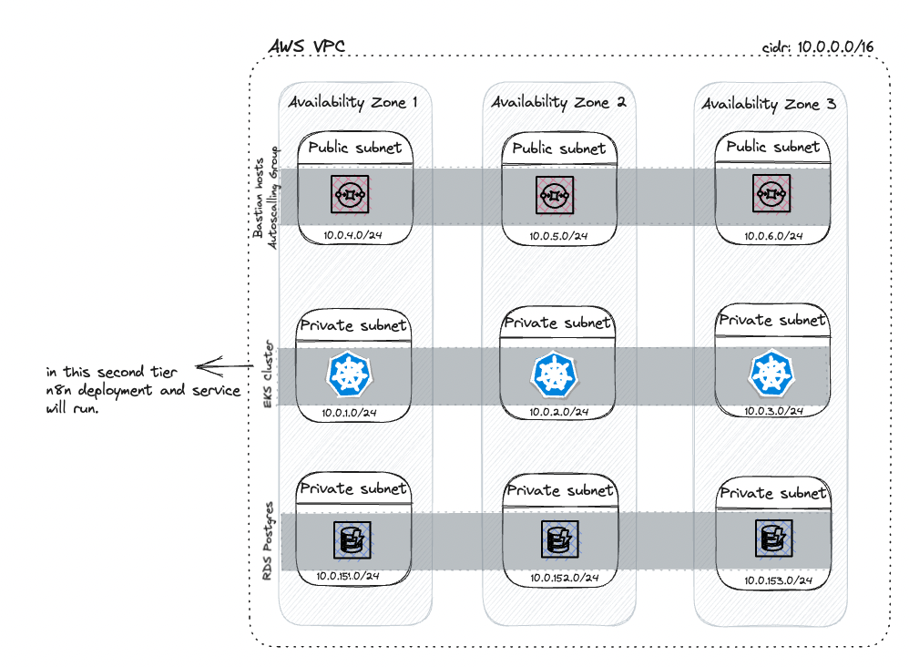
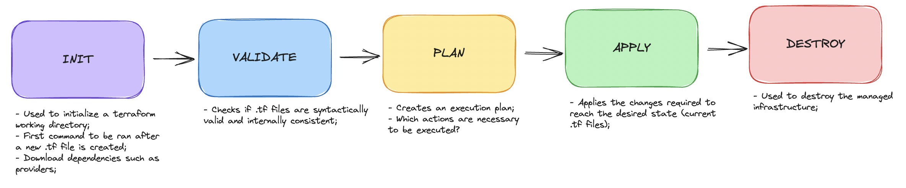
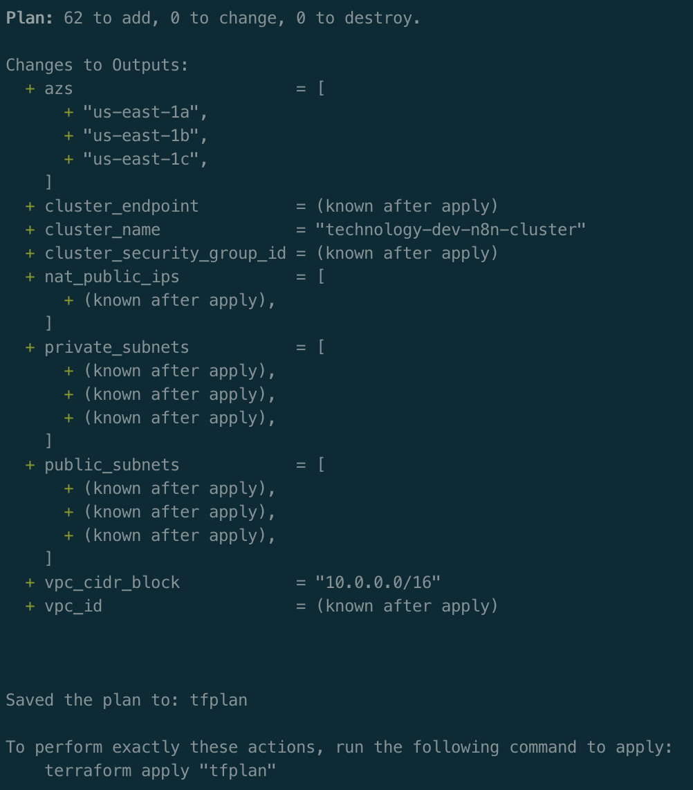
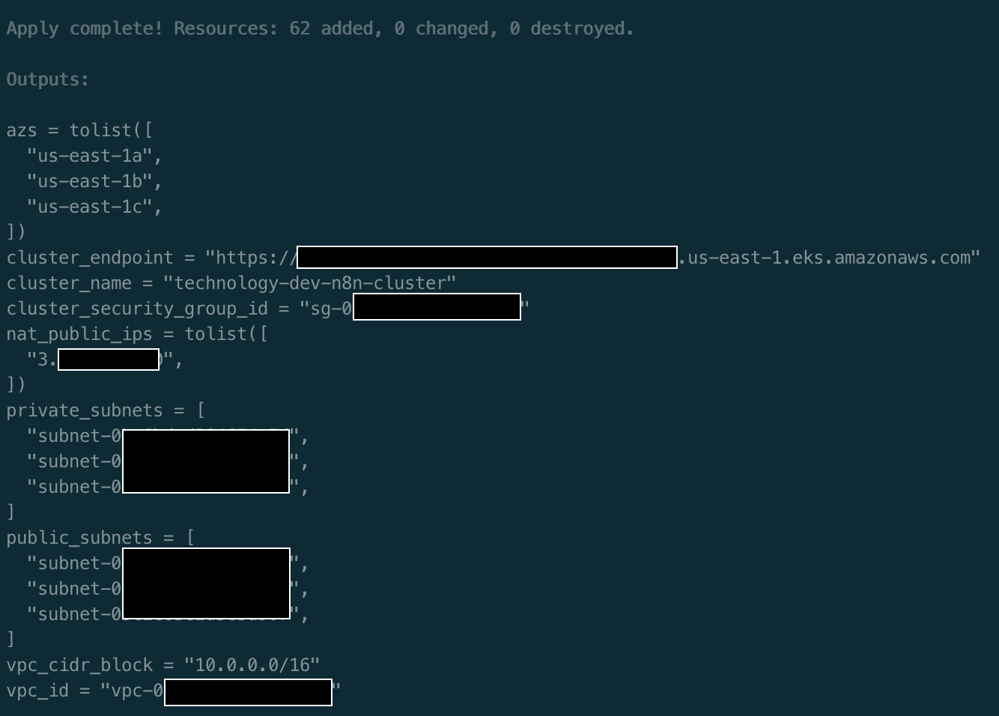
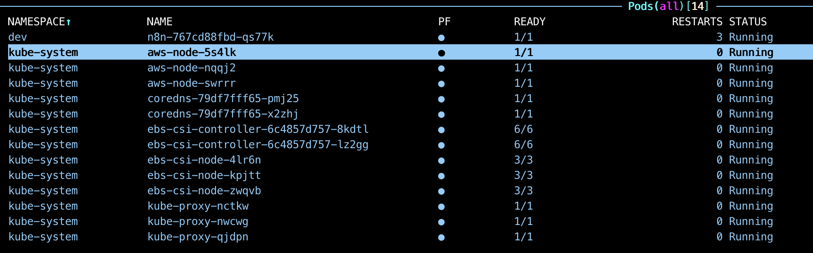
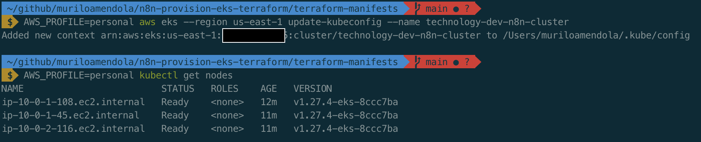
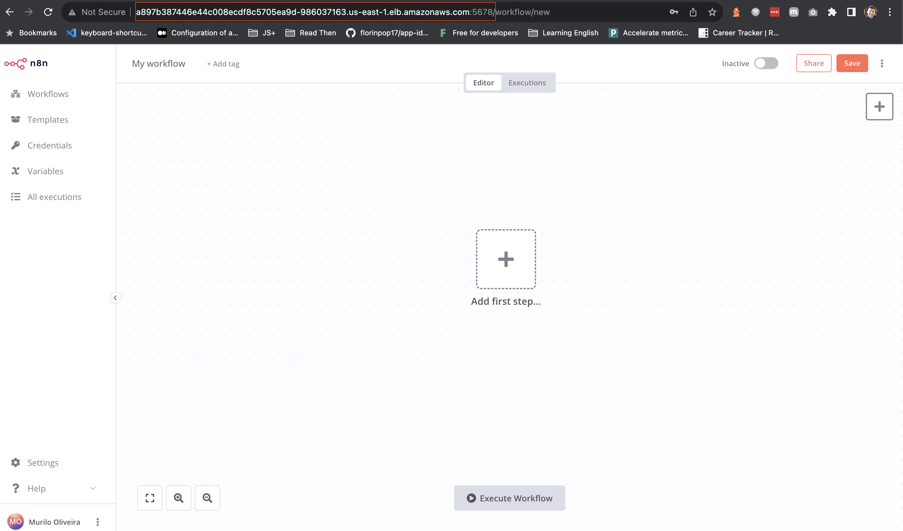

# Learn how to create an EKS Cluster using Terraform and provision n8n tool

> This project was created for study purpose. I don't intend to turn it a production ready project.

The main challenge here is to create an IaC using Terraform, to provide a EKS cluster where we could run n8n tool. It's important to deal with scalability and security aspects.

The draft below ilustrates our project infrastructure and the modules and resource we must create using Terraform.


Looking to this image its clear that we have to create a VPC, and build our EKS cluster over private subnets. So we will need to use NAT Gateways and Internet Gateway to handle inbound and outbound traffic to our nodes. The tool n8n will be configured using postgres as database, so we will have to create a postgres intance using RDS.

> As I've said before, this project is not production ready and for this reason, we are not handle database credentials in a right way (usgin KMS for example)

## Tips

- I'm using VS Code as my IDE and installed HashiCorp Terraform plugin that help us with auto complete suggestions;
- To run terraform command in your machine you must install [Terraform CLI](https://developer.hashicorp.com/terraform/cli);
- As we are using AWS as cloud provider its necessary to have an AWS account and [configured credentials](https://docs.aws.amazon.com/cli/latest/userguide/cli-chap-configure.html) with administrator privilege to create and manage resources;

## Project Structure

Inside the folder `src` are all the .tf files to build our VPC, EKS, RDS and also deployment and service for n8n.

I've tried to follow some best practices to organize complex terraform projects using modules. Basically, I divided the project in 3 main folders: 

- environments: Where I can configure main.tf for each environment. At this case I just use `dev` environment;
- modules: Where I created reusable modules;
- applications: Applications that I intend to run under Kubernetes;

> Note that using this structure we need to run `terraform` commands for each environment folder. So if I intend to apply dev environemnt changes, I need to run terraform init, plan and apply commands inside the folder `./environments/dev/`.

## Running

Based on Terraform workflow below, we have some commands to plan and apply or destroy our managed infrastructure.



After install Terraform CLI and clone this repository, go to the folder terraform-manifests, then, run the following commands to apply changes in resources or create them:

```
terraform init
terraform plan -out apply.tfplan 
terraform apply -auto-approve apply.tfplan 
```

If the commands work like expected you will see successful messages, such as the shown in the pictures below.





And you can see the pod for n8n running.


## Configure kubectl

After apply the configuration files you can configure `kubectl` to execute commands in your EKS Cluster.

To do this, run the command below replacing `region` and `cluster_name` with the correct values

```
aws eks --region $(region) update-kubeconfig --name $(cluster_name)
```

> Note that I don't use aws `default` profile. For this reason I must specify the profile name using variable `AWS_PROFILE` before the command



After resources have been created you can access n8n using the Load Balancer url associated to `n8n-service` with the port 5678.



## Destroy

The destroy process can be done in two ways, using the command `terraform destroy` or making a destroy plan and then running apply command, as we can see below:

```
terraform init
terraform plan -destroy -out destroy.tfplan 
terraform apply -auto-approve destroy.tfplan
```

## Jobs to be done

- Use AWS KMS to handle secrets;
- Configure backend to store terraform remote state in a S3 bucket;
- Use custom domain;
- Handle eks logs using CloudWatch;